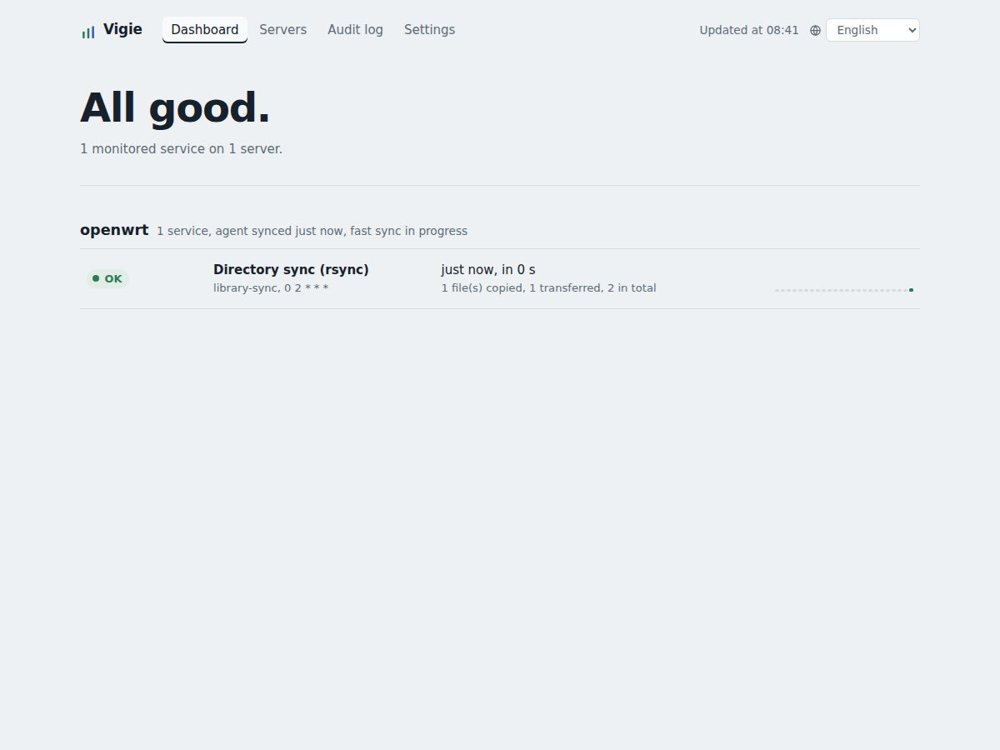
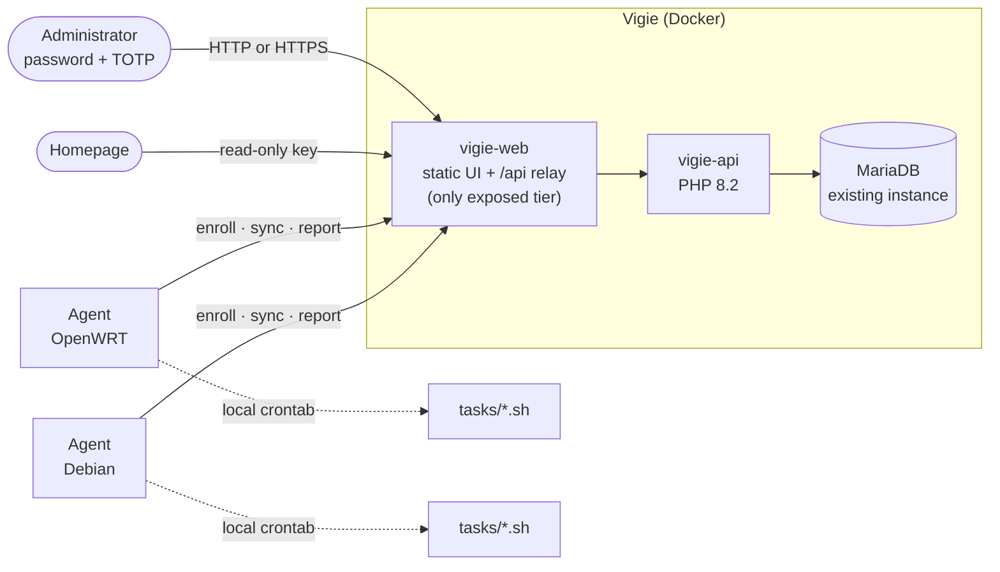
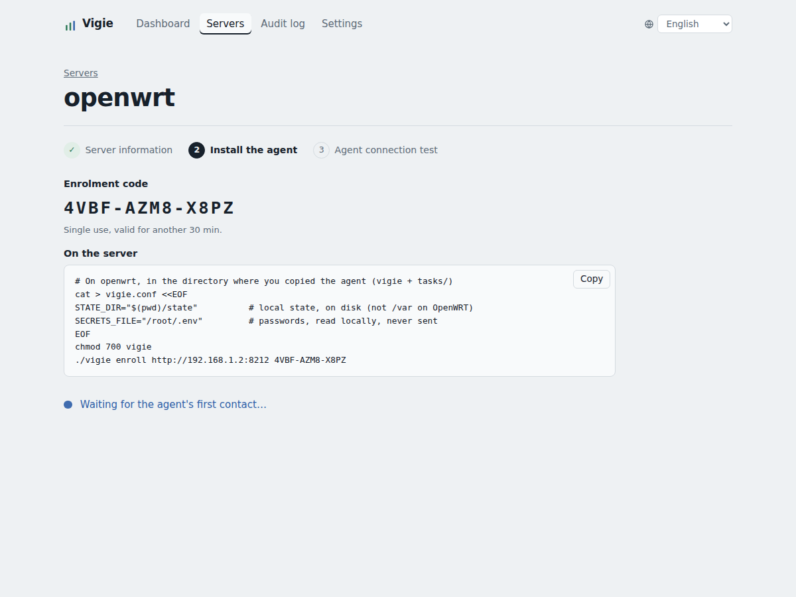
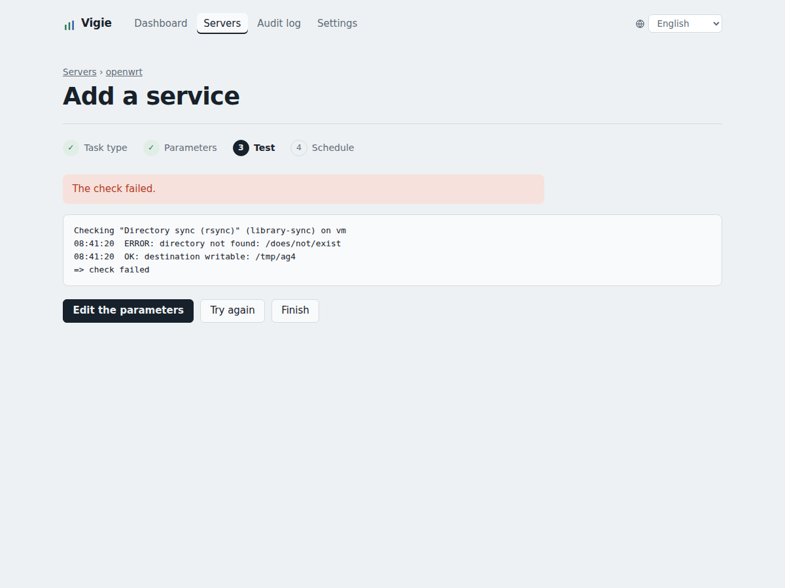

<p align="center"></p>

# Vigie

**Vigie** is a small, self-hosted control plane for the scheduled operations of a handful of Linux servers: backups, database dumps, file copies, RAID and disk checks, cleanups, reboots. A lightweight agent runs on each server; Vigie tells it what to run and when, and shows at a glance whether everything actually happened.

It was built for a home lab (an OpenWRT router running Docker and a Debian server), where a dozen cron scripts had grown into something nobody could monitor: failures went unnoticed, dumps reported success when they had failed, and retention silently stopped working.



## Features

- **One place for every scheduled task.** Servers, services, parameters and schedules are managed from a web interface. Each server's agent writes its own crontab, in a clearly delimited block, in the order you choose.
- **Honest status.** A service is *OK* only if it succeeded recently enough. Vigie also detects runs that never came back (*no news*), runs that take too long, tasks that are late, and agents that stopped syncing.
- **Guided setup.** Adding a server or a service is a wizard: server information → agent installation → connection test; then task → parameters → test on the real server (repeat until it passes) → schedule.
- **Built-in tasks**: rsync copies, MariaDB/MySQL dumps (including databases embedded in application containers), SQLite backups taken while the application runs, Borg archives with optional pause of the applications, OpenWRT configuration backups, software RAID status, disk usage, temporary file cleanup and scheduled reboots. A task is a short shell file: adding your own is easy.
- **Secure by design.** Pull model, per-agent tokens, typed parameters re-validated on the server itself, no free-form commands, secrets that never leave the server, a single administrator with mandatory TOTP, a full audit log.
- **Portable agent.** POSIX `sh` only: busybox `ash` on OpenWRT, `dash` or `bash` on Debian. No `base64`, `jq` or `curl` required.
- **Homepage widget** through a small read-only JSON endpoint.
- **English and French interface**, selectable from a drop-down; the browser's language is used by default, English otherwise. A language is a single dictionary.

## Architecture



Agents always initiate the connection (**pull model**): Vigie never connects to a server and needs no SSH access. On each sync, an agent sends its facts (system, boot time, mount points, containers, the *names* of available secrets, its task catalogue) and receives its services, their parameters and any pending request (test, or run now). It then rewrites its own crontab block if it changed.

**Sync frequency** is set per server, from 1 minute to 24 hours (15 minutes by default): a full sync refreshes the server's facts and configuration. In between, the agent **polls** Vigie every minute with a tiny request ("anything for me?"); when a test, a run or a change is pending, it syncs right away. Tests and changes therefore take effect within a minute, whatever the sync frequency. After such a sync, the agent keeps syncing every minute for 15 minutes, the time to finish setting things up. Polling can be disabled with `POLL=no` in `vigie.conf`.

**Offline behaviour.** If Vigie is unreachable, agents keep running their last known configuration; final run reports are queued locally and delivered later.

## Security model

- **Agents** authenticate with a 256-bit token issued at enrolment; only its SHA-256 is stored. Enrolment codes are single-use and expire after 30 minutes. A token can be revoked at any time.
- **No free-form commands.** The agent only runs tasks present in its own `tasks/` directory. Parameters are typed (`path`, `paths`, `name`, `names`, `varname`, `int`, `bool`, `service`) and validated twice: by the API, then again by the agent before anything is written to disk. Even a compromised Vigie could not make a server run an arbitrary command.
- **Secrets** (database passwords, Borg passphrases) stay on each server, in a `.env`-style file, or in the environment of the container that needs them. Vigie only knows variable *names*. Values are read into private variables of the task (a `TZ` or `PATH` line in a Docker `.env` cannot alter the task's environment), and reach containers through stdin, never on a command line.
- **Administrator**: a single account, created at first sign-in with a one-time setup code printed in the container log, so nobody can claim the instance just by reaching it first. The account only exists once TOTP (RFC 6238) is confirmed. Passwords are hashed with Argon2id; the TOTP secret is encrypted with `VIGIE_APP_KEY` (libsodium). Codes cannot be replayed. Five failures lock sign-in for 15 minutes.
- **Sessions**: `HttpOnly`, `SameSite=Strict` cookie; 30 minutes of inactivity and 12 hours at most, or 7 days with *Stay signed in* on the sign-in screen. Every session is invalidated when the password changes or the administrator is reset. Every state-changing request needs a custom header (CSRF protection), and a strict Content Security Policy is applied.
- **Database**: Vigie's MariaDB user only has rights on Vigie's database, and only from the API container's IP.
- **Audit log**: every sign-in, enrolment, change and request is recorded.

> Vigie itself speaks plain HTTP. Put it behind your reverse proxy with TLS if it is reachable from anywhere but your LAN.

## Requirements

- Docker with Compose v2.
- An existing MariaDB (10.5+) reachable on a Docker network.
- On each server: POSIX `sh`, `awk`, `sed`, `crontab`, and `curl` **or** `wget`/`uclient-fetch`, running as root. Each task has its own needs (`rsync`, `docker`, `borg`, `mdadm`…); a service test reports anything missing.

## Installation

### 1. Database

Edit the password in `server/mariadb-init.sql` (and the IP if you change `VIGIE_API_IP`), then run it as root:

```sh
docker exec -it <mariadb-container> mariadb -u root -p -e "$(cat server/mariadb-init.sql)"
```

### 2. Configuration

Create a `.env` file next to `server/compose.yml`, or add these lines to the `.env` your Compose project already uses:

```sh
VIGIE_DB_PASSWORD=the-password-from-step-1
VIGIE_APP_KEY=...        # tr -dc 'a-f0-9' < /dev/urandom | head -c 64
VIGIE_READ_TOKEN=...     # Homepage widget key: tr -dc 'A-Za-z0-9' < /dev/urandom | head -c 32
VIGIE_PUBLIC_URL=http://192.168.1.10:8212   # Vigie's address as seen by the agents
```

Optional variables, with their defaults:

| Variable | Default | Purpose |
|---|---|---|
| `VIGIE_PORT` | `8212` | Published port of the web tier |
| `VIGIE_NETWORK` | `root_default` | Existing Docker network shared with MariaDB |
| `VIGIE_WEB_IP`, `VIGIE_API_IP` | `172.18.0.212`, `172.18.0.213` | Fixed container IPs (the database grant uses the API's) |
| `VIGIE_DB_HOST`, `VIGIE_DB_NAME`, `VIGIE_DB_USER` | `8190-mariadb`, `VIGIE`, `vigie` | Database connection |
| `VIGIE_DEFAULT_INTERVAL` | `15` | Default agent sync interval, in minutes |
| `VIGIE_FAST_WINDOW` | `15` | Minutes of one-minute sync after a change |
| `VIGIE_DEBUG` | unset | `1` returns error details in API responses |

> **Keep `VIGIE_APP_KEY` safe.** It encrypts the TOTP secret: if it changes, sign-in is impossible until you reset the administrator (see *Lost access*).

The variables are prefixed `VIGIE_` on purpose: in a `.env` shared with other projects, generic names such as `DB_HOST` would collide.

### 3. Start

```sh
docker compose -f server/compose.yml up -d --build
docker exec -it 8213-vigie-api vigie-admin doctor
```

The database schema is created, and later upgraded, automatically on the first request. `vigie-admin db:init` does the same explicitly and prints a **first-run setup code**; you can also find it with:

```sh
docker logs 8213-vigie-api 2>&1 | grep "SETUP CODE"
```

### 4. First sign-in

Open `http://<host>:8212`, enter the setup code, choose a password (12 characters minimum), scan the QR code with an authenticator app (Aegis, 2FAS, Bitwarden, Google Authenticator…) and confirm with a code.

## Usage

### Adding a server

**Servers → Add a server.** Vigie shows an enrolment code and the commands to run on the server:

1. Copy the agent to the server (for example to `/root/agent-vigie`): the `vigie` script and the `tasks/` directory.
2. Create `vigie.conf` from `vigie.conf.example`. On OpenWRT, put `STATE_DIR` on a disk: `/var` is in RAM.
3. Run `./vigie enroll <vigie-url> <code>`.

The page waits for the agent's first contact, then lists what it reported: system, available tasks, containers.



### Adding a service

**Add a service** on the server's page: pick a task, fill in its parameters (suggestions come from the server's mount points, containers and secret names), then **Save and test**. The agent runs the task's checks on the real server, without changing anything, and returns its output. Fix the parameters until the test passes, then choose a schedule.



A service can only be scheduled after a successful test; the service page lets you force it if you know what you are doing.

### Ordering services

On a server's page, **Change the order** lets you move services up and down, or **Sort by time** (hour, then minute; hourly jobs first, disabled services last). The order applies to the server page, the dashboard and the server's crontab.

## Built-in tasks

| Task | Purpose | Notes |
|---|---|---|
| `disk-usage` | Disk usage of mount points | Warning and error thresholds |
| `folder-sync` | rsync copy of a directory | Checks the destination is mounted; optional `--delete` |
| `db-dump` | Dump of a database running in a container: MariaDB, MySQL, or an application with its own embedded database | Uses the container's own client; password from the secrets file or from the container's environment; checks the dump is complete; daily/weekly/monthly retention (hard links) |
| `sqlite-backup` | Backup of an SQLite database, usually inside an application container | Consistent copy made by SQLite itself while the application runs; integrity check; daily/weekly/monthly retention |
| `openwrt-backup` | `sysupgrade -b` configuration archive | Checks the archive; same retention |
| `dir-cleanup` | Purge of old temporary files and work directories | Age in minutes |
| `backup-borg` | Borg archive of one or more directories | Optional pause of the applications (see below); `prune` + `compact` |
| `raid-check` | Software RAID (`mdadm`) status | Degraded = error, rebuilding = warning |
| `reboot` | Scheduled reboot of the server | Waits for running services; optional "only if required" (see below) |

### Consistent Borg archives

`backup-borg` can pause the applications writing to the archived directories, in this order, each step being optional:

1. **Nextcloud maintenance mode** (`CONTAINER`): better than stopping Nextcloud, since users see a maintenance page and background jobs pause.
2. **Database dump** (`DUMP_SERVICE`): a `db-dump` service on the same server, run while its database is still up.
3. **Containers stopped** (`STOP_CONTAINERS`): space-separated container names.
4. The Borg archive is created.
5. Containers are started again in reverse order, and maintenance mode is switched off. This always happens: on success, on failure, and when the run is interrupted.

### Backing up databases

`db-dump` runs the dump inside the database container, so it connects as `'<user>'@'localhost'`. Use a dedicated read-only account, never Vigie's own account (which only accepts connections from the API container and can write). Grant it each database to back up; on Linux, database names are case-sensitive:

```sql
CREATE USER 'backup'@'localhost' IDENTIFIED BY '...';
GRANT SELECT, SHOW VIEW, TRIGGER, EVENT, LOCK TABLES ON `VIGIE`.* TO 'backup'@'localhost';
-- one GRANT line per database
```

Avoid `ON *.*`: it would also expose the `mysql` system database, which holds the password hashes of every account.

The password comes from one of two places:

- `PASSWORD_VAR`: a variable of the server's secrets file (for example `MARIADB_BACKUP_PASSWORD=...` in `/root/.env`);
- `PASSWORD_ENV`: a variable of the container's own environment, typical for a database embedded in an application container (`MYSQL_ROOT_PASSWORD`…). Nothing to copy: the value is read inside the container. To list a container's variable names without printing their values:

  ```sh
  docker inspect -f '{{range .Config.Env}}{{println .}}{{end}}' <container> | cut -d= -f1
  ```

The container must ship a `mariadb-dump` or `mysqldump` client, as the official MariaDB and MySQL images do.

### SQLite databases

Many self-hosted applications keep their data in an SQLite file rather than a database server: there is no account and no password. Copying the file while the application writes to it can produce a corrupt copy, so `sqlite-backup` asks SQLite itself for a consistent snapshot (`.backup` or `VACUUM INTO`), without stopping the application, then checks the copy with `PRAGMA quick_check`. The result is a compressed, plain SQLite file: to restore, stop the application, decompress the file in place of the database, and start it again.

- `CONTAINER`: the application's container; leave empty for a file on the server itself.
- `DB_PATH`: the database file **as seen from the container**. To find it: `docker exec <container> find / -name "*.db" -o -name "*.sqlite*"`.

The copy uses whatever the container ships: the `sqlite3` client, PHP with `pdo_sqlite` (as in the official PHP images), or Python. It runs as the owner of the database file: run as root, SQLite could leave root-owned `-wal`/`-shm` files that the application could no longer write.

### Scheduled reboots

`reboot` starts the reboot in the background after `DELAY_SEC` seconds (60 by default), once the run has finished, so its report reaches Vigie before the server goes down. If other Vigie services are still running, it waits for them for up to `WAIT_MAX_MIN` minutes (60 by default); after that, it gives up without rebooting and reports an error. With `ONLY_IF_NEEDED=yes`, it only reboots when the system asks for it (`/var/run/reboot-required`, written by Debian and Ubuntu package upgrades); other systems, OpenWRT included, never do.

The server page shows when the server last started, so you can confirm the reboot happened. **Test** never reboots, and **Run now** asks for confirmation. Rebooting the server that hosts Vigie itself works too: Vigie is simply unavailable until the server is back.

## The agent

```
vigie enroll <url> <code>       register this server with Vigie
vigie sync                      fetch configuration and requests (run by cron)
vigie poll                      quick check for pending work, then sync if needed (cron)
vigie run <service> [--job N]   run a service
vigie check <service> [--job N] check a service's prerequisites, changing nothing
vigie list                      services configured on this server
vigie tasks                     available task types and their parameters
vigie status                    latest result of each service
```

`vigie.conf` only holds local settings: `STATE_DIR`, `SECRETS_FILE` (`.env` format, read without being executed), `HEARTBEAT_SEC`, `LOG_KEEP`, `POLL`. `VIGIE_URL` and `AGENT_TOKEN` are added by `vigie enroll`.

> **`vigie.conf` holds the agent's token** and cannot be recreated from Vigie. If it is lost, recreate the local settings and enrol again from the server's page (**Re-enrol**): services and history are kept. On OpenWRT, add it to `/etc/sysupgrade.conf` so that `openwrt-backup` includes it.

Behaviour worth knowing:

- A service never runs twice at the same time (lock with stale-lock detection).
- Long tasks send a "running" signal every `HEARTBEAT_SEC` seconds; if the signal stops, the dashboard shows *no news*.
- Logs are kept locally (`STATE_DIR/logs`, 30 runs per service) and their last lines are sent to Vigie.
- Services the agent refuses (unknown task, invalid value) are reported back and shown on the server page.
- The crontab block is delimited by `# >>> vigie` and `# <<< vigie`; the rest of the crontab is left untouched.
- `curl` is used when it works; otherwise the agent falls back to `wget` or `uclient-fetch`. A `curl` broken by a partial package upgrade is detected and skipped.

## Writing a task

A task is a shell file in `agent/tasks/` that defines `task_run` and, ideally, `task_check`. Its parameters are declared in its header:

```sh
# Short description of the file.
TASK_DESC="Human-readable description"
TASK_MAX_AGE=1560       # minutes without success before "late"
TASK_MAX_RUNTIME=60     # minutes before "too long"
# @param NAME | type | required|optional | Label | default
# @param TARGET_DIR | path | required | Backup directory |
# @param KEEP_DAILY | int  | optional | Daily copies kept | 7

task_check() {          # read-only checks, used by "Test"
    v_require_dir "$TARGET_DIR" w && v_ok "destination writable"
}

task_run() {
    v_require_dir "$TARGET_DIR" w || return 1
    # ... do the work; output goes to the log ...
    v_metric bytes 12345
    v_summary "One line shown in the dashboard"
}
```

Parameters are exported as environment variables. Types: `path` (absolute path), `paths` (space-separated absolute paths), `name` (letters, digits, `._-`), `names` (space-separated names), `varname` (a variable name), `int`, `bool` (`yes`/`no`), `service` (the id of another service on the same server).

Helpers available to tasks:

| Helper | Purpose |
|---|---|
| `v_log`, `v_ok` | Log a line |
| `v_warn` | Log a warning; the run ends as *warning* |
| `v_fail` | Log an error; the run ends as *error* |
| `v_summary`, `v_metric name value` | Summary line and metrics sent to Vigie |
| `v_require_cmd`, `v_require_dir dir [w]`, `v_require_mount`, `v_require_container` | Prerequisite checks that log a clear error |
| `v_load_secrets`, `v_secret VAR` | Read the secrets file, get a value by name |
| `v_gfs base file prefix` | Daily/weekly/monthly retention (see `db-dump.sh`) |
| `v_fsize`, `v_hsize` | File size, human-readable size |

The agent picks up new tasks at its next sync. Declared labels are shown in the interface; to translate them, add `task.<name>` and `param.<task>.<NAME>` (or `param.<NAME>`) keys to the interface dictionaries, and `param.help.<task>.<NAME>` for a help text.

## Homepage widget

`GET /api/homepage` returns a summary designed for Homepage's `customapi` widget; `server/homepage/services.yaml` is a ready-to-paste example. Options:

- `filter=active` (everything that is not OK) or `filter=problems` (errors and warnings only);
- `host=<server>` to restrict to one server;
- `lang=en|fr` for the labels (English by default).

Vigie's logo is served at `/icon-192.png` and `/icon-512.png`, for the service's `icon:`.

When `VIGIE_READ_TOKEN` is set, the key must be sent in the `X-API-Key` header.

## Languages

The interface ships with English and French. It follows the browser's language, falls back to English, and remembers the choice made in the drop-down.

The API never returns sentences on their own: errors and states come as codes with parameters, and the interface translates them. To add a language, add a dictionary to `I18N` in `server/web/public/index.html`; any missing key falls back to English, so a partial translation works. Agent logs are always in English.

## Upgrading

1. **Vigie**: replace `server/api/` and `server/web/`, then `docker compose up -d --build`. The database schema is upgraded automatically on the first request. Reload the interface with Ctrl+Shift+R.
2. **Agents**: replace the `vigie` script and the whole `tasks/` directory, but never `vigie.conf` or `STATE_DIR`:

   ```sh
   rsync -av --delete agent/tasks/ root@server:/root/agent-vigie/tasks/
   scp agent/vigie root@server:/root/agent-vigie/vigie
   ```

   Unzipping a release over an older copy does not remove renamed files; `--delete` does. Leftover files are harmless anyway: a task file superseded by its renamed version is ignored, and `vigie tasks` points it out.

Vigie and agents can be upgraded in any order. Renamed tasks (`library-sync` → `folder-sync`, `nextcloud-borg` → `backup-borg`, `mariadb-dump` → `db-dump`) keep working under both names.

## Command line

Day-to-day administration happens in the interface. `vigie-admin`, inside the API container, applies the same rules and is meant for diagnostics and rescue:

```sh
docker exec -it 8213-vigie-api vigie-admin            # list of commands
docker exec -it 8213-vigie-api vigie-admin doctor     # extensions, files, key, database
docker exec -it 8213-vigie-api vigie-admin server:list
docker exec -it 8213-vigie-api vigie-admin audit 50
```

### Lost access

If you lost the password or the phone:

```sh
docker exec -it 8213-vigie-api vigie-admin admin:reset --confirm=yes
```

This deletes the administrator account (servers, services and history are kept), closes all sessions and prints a new setup code. Sign in again as on the first run.

## API

| Route | Access | Purpose |
|---|---|---|
| `POST /api/agent/enroll` | enrolment code | Exchange a code for a token |
| `POST /api/agent/poll` | agent token | Quick check for pending work |
| `POST /api/agent/sync` | agent token | Send facts, receive configuration and requests |
| `POST /api/agent/report` | agent token | Run report (running or final) |
| `POST /api/agent/job` | agent token | Result of a check |
| `GET /api/homepage` | read key | Homepage summary |
| `GET /api/auth/status`, `POST /api/auth/*` | public / session | Setup, sign-in, sign-out, password change |
| `GET /api/state` | session | Dashboard state |
| `GET·POST /api/admin/*` | session | Servers, services, order, requests, audit log |

Errors are returned as `{"error": "English text", "code": "...", "params": {...}}`.

## Troubleshooting

Start with `vigie-admin doctor`: it checks PHP extensions, mounted files, `VIGIE_APP_KEY` and the database connection, with a hint for each failure. API errors are always written to `docker logs 8213-vigie-api`.

| Symptom | Likely cause |
|---|---|
| *Database unavailable* (503) | Wrong `VIGIE_DB_*` values; the log shows the exact error |
| `Access denied for user 'vigie'@'…'` | Wrong password, or the grant does not match the API container's IP |
| `Unknown database` | The database name's case differs (`VIGIE` ≠ `vigie`) |
| Wrong database or credentials used | Generic variables such as `DB_HOST` from a shared `.env`: use the `VIGIE_` variables |
| *VIGIE_APP_KEY missing or invalid* | The key must be exactly 64 hexadecimal characters |
| Agent: *Vigie unreachable* | `VIGIE_PUBLIC_URL` is not reachable from the server, or a firewall blocks it |
| Service *rejected by the agent* | The task is missing from that agent's `tasks/`, or a value fails the agent's own validation |
| Dump: `Access denied … to database` (1044) | The backup account has no `GRANT` on that database, or the name's case differs |
| Times in task logs off by a few hours | Agent older than 2.4, which exported the secrets file (and its `TZ` line) to tasks |
| Nothing runs on OpenWRT | `vigie.conf` missing, `STATE_DIR` in RAM lost at reboot, or `cron` not enabled (`/etc/init.d/cron enable && /etc/init.d/cron start`) |
| `Docker Compose is configured to build using Bake, but buildx isn't installed` | Harmless warning; set `COMPOSE_BAKE=false` or install the `buildx` plugin |

## Project layout

```
agent/
  vigie                   the agent (POSIX sh)
  vigie.conf.example
  tasks/*.sh              built-in tasks
server/
  compose.yml
  mariadb-init.sql        database and user creation
  api/
    public/index.php      front controller
    inc/                  util, db, agent, state, auth, admin
    bin/vigie-admin       command line
    schema.sql            applied and upgraded automatically
  web/
    public/index.html     the whole interface (vanilla JS, no build step)
    public/vigie.svg      logo; favicon.svg and icon-*.png for tabs, phones and Homepage
    public/vendor/        qrcode-generator
    vigie.conf            Apache relay and security headers
  homepage/services.yaml  Homepage widget example
docs/screenshots/
```

## Third-party components

- [qrcode-generator](https://github.com/kazuhikoarase/qrcode-generator) by Kazuhiko Arase, MIT licence, bundled in `server/web/public/vendor/`.
- [Atkinson Hyperlegible](https://www.brailleinstitute.org/freefont/) font by the Braille Institute, SIL Open Font Licence, loaded from Google Fonts with a system font fallback.

## Licence

See [LICENSE](LICENSE).
